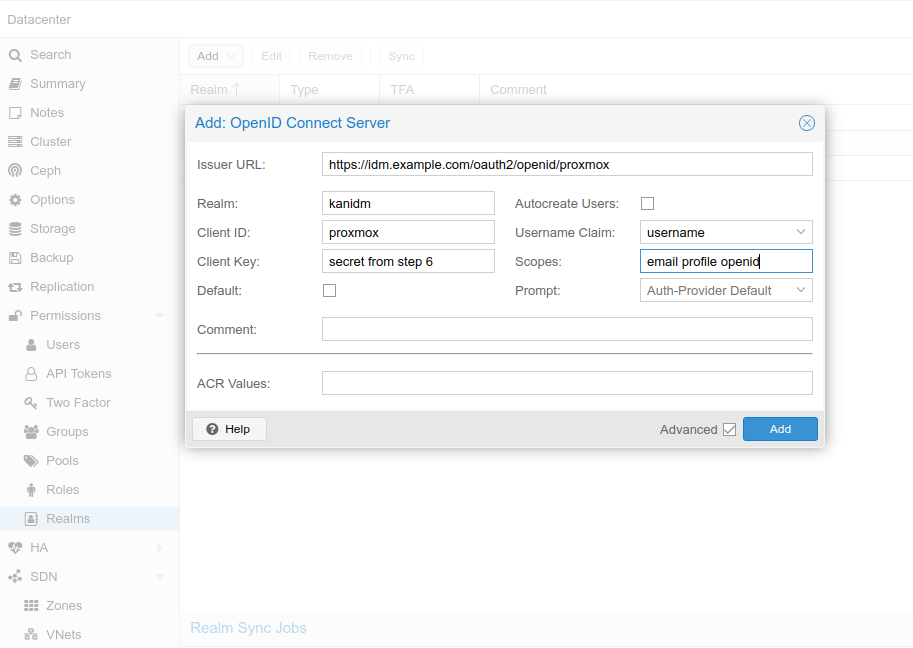

# Proxmox PVE/PBS

## Helpful links

- <https://pve.proxmox.com/wiki/User_Management>
- <https://pve.proxmox.com/pve-docs/pve-admin-guide.html#pveum_openid>

## Proxmox OIDC limitation

As of December 2024 OIDC implementation in proxmox supports only authentication.
Authorization has to be done manually.
Mapping user to specific groups won't work yet (steps 2,3,4).

Patch for this feature exists, but it hasn't been tested extensively:
<https://lore.proxmox.com/pve-devel/20240901165512.687801-1-thomas@atskinner.net/>
See also:
<https://forum.proxmox.com/threads/openid-connect-default-group.103394/>

## On Kanidm

### 1. Create the proxmox resource server

```bash
kanidm system oauth2 create proxmox "proxmox" https://yourproxmox.example.com
```

### 2. Create the appropriate group(s)

```bash
kanidm group create proxmox_users --name idm_admin
kanidm group create proxmox_admins --name idm_admin
```

### 3. Add the appropriate users to the group

```bash
kanidm group add-members proxmox_users user.name
kanidm group add-members proxmox_admins user.name
```

### 4. scope map

```bash
kanidm system oauth2 update-claim-map-join 'proxmox' 'proxmox_role' array
kanidm system oauth2 update-claim-map 'proxmox' 'proxmox_role' 'proxmox_admins' 'admin'
kanidm system oauth2 update-claim-map 'proxmox' 'proxmox_role' 'proxmox_users' 'user'
```

### 5. Add the scopes

```bash
kanidm system oauth2 update-scope-map proxmox proxmox_users email profile openid
```

### 6. Get the client secret

```bash
kanidm system oauth2 show-basic-secret proxmox
```

Copy the value that is returned.

## On proxmox server

### Using WebGUI

Go to <https://yourproxmox.example.com>
Select Datacenter->Realms->Add->OpenID Connect Server

Issuer URL:

- <https://idm.example.com:8443/oauth2/openid/proxmox>
When kanidm is behind reverse proxy or when using docker port mapping:
- <https://idm.example.com/oauth2/openid/proxmox>

Realm: give some proper name or anything that's meaningful

Client ID: name given in step 1 (resource server)

Client Key: secret from step 6

Autocreate Users: Automatically create users if they do not exist. Users are stored in Proxmox Cluster File System (pmxcfs) - /etc/pve/user.cfg

### Using CLI

Login to proxmox node and execute:

```bash
pveum realm add kanidm --type openid --issuer-url https://idm.example.com/oauth2/openid/proxmox --client-id proxmox --client-key="secret from step 6" --username-claim username --scopes="email profile openid" --autocreate
```

